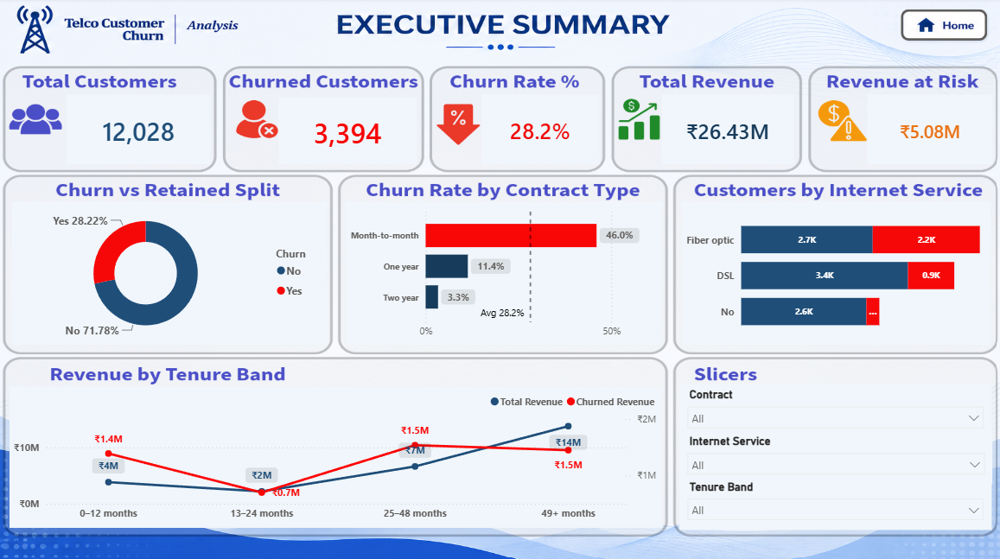

# 📊 Customer Retention Analysis – Telecom Churn Prediction

_Analyzing customer behavior and churn drivers to support retention strategy and predictive decision-making using Python, Machine Learning, and Power BI._

---

## 📌 Table of Contents

- [Overview](#overview)
- [Business Problem](#business-problem)
- [Dataset](#dataset)
- [Tools & Technologies](#tools--technologies)
- [Project Structure](#project-structure)
- [Data Cleaning & Preparation](#data-cleaning--preparation)
- [Exploratory Data Analysis (EDA)](#exploratory-data-analysis-eda)
- [Feature Engineering & Modeling](#feature-engineering--modeling)
- [Research Questions & Key Findings](#research-questions--key-findings)
- [Dashboard](#dashboard)
- [How to Run This Project](#how-to-run-this-project)
- [Final Recommendations](#final-recommendations)
- [Author & Contact](#author--contact)

---

## Overview

This project evaluates customer churn behavior for **AlphaCom**, a telecommunications provider, to drive strategic insights for retention, pricing, and service-bundling decisions. A complete pipeline was built using Python for data cleaning, EDA, and predictive modeling, and Power BI for visualization.

---

## Business Problem

AlphaCom has recently experienced a concerning rise in customer churn despite offering competitive services and a wide product portfolio. This project aims to:

- Identify the key demographic, account, and service-level drivers of churn
- Quantify how contract type, tenure, and payment method relate to churn risk
- Build a predictive model to flag high-risk customers before they leave
- Translate findings into actionable retention strategies
- Support data-driven decisions on bundling, pricing, and outreach

---

## Dataset

- Single CSV file located in `data/raw/customer_churn.csv`
- 12,055 customer records across 20 features: demographics (gender, senior citizen, partner, dependents), account details (tenure, contract, payment method, monthly/total charges), and subscribed services (phone, internet, streaming, security add-ons)
- Cleaned dataset generated at `data/processed/cleaned_customer_churn.csv`
- Target variable: `Churn` (Yes/No)

---

## Tools & Technologies

- Python (Pandas, NumPy, Matplotlib, Seaborn, Statsmodels)
- Scikit-learn, XGBoost, Imbalanced-learn (modeling)
- Jupyter Notebook
- Power BI (Interactive Dashboard)
- GitHub

---

## Project Structure

```
Customer-Retention-Analysis/
│
├── data/
│   ├── raw/
│   │      customer_churn.csv
│   │
│   └── processed/
│          cleaned_customer_churn.csv
│
├── notebooks/
│      Customer_Churn_EDA.ipynb
│
├── scripts/
│      data_cleaning.py
│      feature_engineering.py
│      visualization.py
│
├── dashboards/
│      Customer_Churn.pbix
│
├── images/
│      dashboard_home.png
│      churn_analysis.png
│      retention_analysis.png
│
├── reports/
│      Customer_Churn_Project_Report.pdf
│
├── logs/
│      project.log
│
├── requirements.txt
│
├── README.md
│
├── .gitignore
│
└── LICENSE
```

---

## Data Cleaning & Preparation

- Fixed invalid/negative `tenure` values
- Stripped currency symbols (`$`, `£`) from `MonthlyCharges` and `TotalCharges` and converted to numeric
- Imputed missing numerical values using the median
- Standardized inconsistent text formatting in categorical columns (`PaymentMethod`, `Churn`) — trimmed whitespace, normalized casing
- Mapped `SeniorCitizen` (0/1) to a readable Yes/No category
- Removed duplicate rows (12,055 → 12,028 records)

---

## Exploratory Data Analysis (EDA)

**Univariate Analysis:**

- Bimodal distribution of tenure (many very new and many very long-tenured customers)
- Right-skewed distribution for Total Charges
- Majority of customers are on month-to-month contracts and pay via Electronic Check

**Bivariate & Multivariate Analysis:**

- Month-to-month contracts show the highest churn rate
- Customers with short tenure churn far more than long-tenured customers
- Fiber optic customers churn more than DSL or no-internet customers
- Customers without Online Security or Tech Support churn at elevated rates
- Electronic check payers churn more than customers on automatic payment methods

**Correlation & Risk Segments:**

- Strong relationship between tenure and Total Charges
- Highest-risk segments identified via combined Contract × Payment Method × Tech Support analysis

---

## Feature Engineering & Modeling

- Created a `tenure_group` feature (New, Medium, Long, Very Long) for better interpretability
- Encoded target variable (`Churn_New` → 0/1) and one-hot encoded categorical predictors
- Split data 70% train / 15% validation / 15% test, stratified on churn
- Trained and compared: Logistic Regression, Decision Tree, Bagging, Random Forest, AdaBoost, Gradient Boosting
- Hyperparameter-tuned Random Forest, AdaBoost, and Gradient Boosting
- **Final Model:** Tuned Gradient Boosting Classifier — best balance of recall, precision, and ROC-AUC across train, validation, and test sets

---

## Research Questions & Key Findings

1. **Contract Type**: Month-to-month customers churn significantly more than one/two-year contract holders
2. **Tenure**: Customers within their first 12 months are the highest churn-risk group
3. **Internet Service**: Fiber optic subscribers churn more than DSL/no-internet customers
4. **Add-on Services**: Lack of Online Security and Tech Support correlates with higher churn
5. **Payment Method**: Electronic check payers churn more than customers using automatic payments
6. **Charges**: Churned customers have higher average monthly charges but lower total charges (consistent with shorter tenure)

---

## Dashboard

Power BI Dashboard shows:

- Customer Overview & Demographics
- Churn Rate by Contract, Tenure, and Payment Method
- Service Add-on Impact on Retention
- High-Risk Customer Segments



---

## How to Run This Project

1. Clone the repository:

```bash
git clone https://github.com/yourusername/Customer-Retention-Analysis.git
```

2. Set up the environment:

```bash
cd Customer-Retention-Analysis
python -m venv venv
source venv/bin/activate   # Windows: venv\Scripts\activate
pip install -r requirements.txt
```

3. Run the data cleaning pipeline:

```bash
python scripts/data_cleaning.py
```

4. Run feature engineering and train/test split:

```bash
python scripts/feature_engineering.py
```

5. Open and run the notebook:
   - `notebooks/Customer_Churn_EDA.ipynb`

6. Open the Power BI Dashboard:
   - `dashboards/Customer_Churn.pbix`

---

## Final Recommendations

- Prioritize retention outreach for new, month-to-month customers within their first 12 months
- Bundle Online Security and Tech Support with Fiber optic plans to reduce churn risk
- Encourage migration from Electronic Check to automatic payment methods
- Offer incentives for upgrading from month-to-month to annual contracts
- Deploy the churn model to score the active customer base monthly and trigger proactive retention campaigns

---

## Author & Contact

**Sandipan Roy**
<br>
Data Analyst
<br>
📧 Email: [sandipanroy33@gmail.com](sandipanroy33@gmail.com)
<br>
🔗 [LinkedIn](https://linkedin.com/in/SandipanRoy19)
<br>
🔗 [Portfolio](#)
